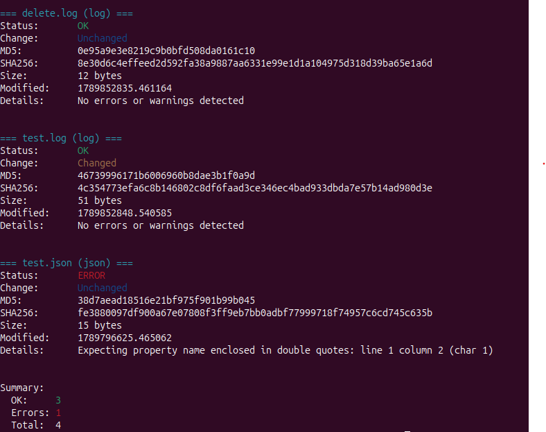

# FileCheckerCache

A lightweight DevOps-style file validation and integrity tool designed to scan folders, classify files, validate content, compute hashes, detect changes, and produce clean, colorized terminal reports. Built for clarity, reliability, and extensibility.

---

## Features

- Automatic file classification (text, log, json)
- Content validation with detailed error reporting
- MD5 + SHA256 hashing for integrity checks
- File size and modification timestamp capture
- Change detection (NEW, CHANGED, UNCHANGED)
- Clean, colorized terminal output
- Summary footer (OK, Errors, Total)
- CLI support (`python3 filechecker_cache.py <folder>`)

---

## Example Output

=== test.txt (text) ===
Status:       OK
Change:       new
MD5:          21af6ecbb6ac502ea386aa875e63164e
SHA256:       bba2c39025e8d6e9a0ba5fd0d0d27500f0dcffad2c249c83b5b1bd0b26375e8e
Size:         22 bytes
Modified:     1789796527.3406873
Details:      Text file is valid

=== test.log (log) ===
Status:       OK
Change:       new
MD5:          f3c87c25a182348bdcab0f68a68d9d3c
SHA256:       f525b74e68fadc1aa10273450f14026b367db7131033aabec61bb94fde0a2c55
Size:         17 bytes
Modified:     1789796669.4630492
Details:      No errors or warnings detected

=== test.json (json) ===
Status:       error
Change:       new
MD5:          38d7aead18516e21bf975f901b99b045
SHA256:       fe3880097df900a67e07808f3ff9eb7bb0adbf77999718f74957c6cd745c635b
Size:         15 bytes
Modified:     1789796625.465062
Details:      Expecting property name enclosed in double quotes: line 1 column 2 (char 1)

Summary:
  OK:     2
  Errors: 1
  Total:  3

**What This Output Shows**
- Unchanged file (`delete.log`)
- Changed file (`test.log`)
- JSON parsing error (`test.json`)
- MD5 + SHA256 hashing
- File size and modification timestamps
- Summary block with OK/error totals

---

## Folder Structure Example

testdata/
├── test.txt
├── test.log
└── test.json

---

## How It Works

1. Scan folder  
   The tool walks the target directory and collects all files.

2. Classify file type  
   Each file is mapped to a validator based on extension.

3. Build RuleContext  
   A context object is created containing:
   - path  
   - file type  
   - previous baseline info  
   - current metadata  

4. Validate content  
   Each validator returns:
   - status (OK or error)
   - details (validation message)

5. Compute hashes  
   MD5 and SHA256 are generated for integrity tracking.

6. Produce FileCheckResult  
   A structured result object is created for each file.

7. Render report  
   Results are printed using a clean, colorized formatter.

8. Summary footer  
   Totals for OK, Errors, and Total files.

---

## CLI Usage

python3 filechecker_cache.py
python3 filechecker_cache.py testdata/
python3 filechecker_cache.py /path/to/your/folder

If no folder is provided, it defaults to `testdata`.

---

## Architecture Overview

            ┌──────────────┐
            │   Scan Dir    │
            └──────┬───────┘
                   │
            ┌──────▼───────┐
            │   Classify    │
            └──────┬───────┘
                   │
            ┌──────▼───────┐
            │ Build Context │
            └──────┬───────┘
                   │
            ┌──────▼───────┐
            │   Validate    │
            └──────┬───────┘
                   │
            ┌──────▼───────┐
            │   Hashing     │
            └──────┬───────┘
                   │
            ┌──────▼───────┐
            │   Results     │
            └──────┬───────┘
                   │
            ┌──────▼───────┐
            │   Summary     │
            └──────────────┘

---

## Roadmap

- Baseline saving to disk
- Change detection (NEW, CHANGED, UNCHANGED)
- YAML/JSON rule configuration
- Additional validators (XML, CSV, INI, YAML)
- Recursive directory scanning
- CI integration (GitHub Actions)
- Optional pip packaging (`pip install filechecker-cache`)
- Optional `filechecker` command-line executable

---

## License

MIT License (or whichever you choose)

---

## Author

Sheldon — DevOps-focused automation builder, Linux-first workflow enthusiast, and creator of FileCheckerCache.
